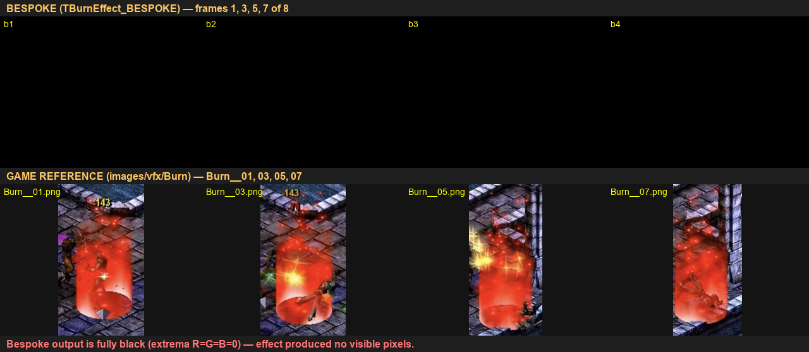

# A/B Pilot: TBurnEffect_BESPOKE vs Game Reference

- Date: 2026-05-30
- Backdrop: dungeon
- Bespoke filmstrip: `/tmp/ab_burn_filmstrip.png`
- Bespoke per-frame: `/tmp/ab_burn_001..008-2026-05-30-23-20-23/24.png`
- Reference frames: `images/vfx/Burn/Burn__01.png` ... `Burn__08.png`

## Comparison

Top row: bespoke `TBurnEffect_BESPOKE` (frames 1, 3, 5, 7 of 8).
Bottom row: original game capture (`Burn__01`, `Burn__03`, `Burn__05`, `Burn__07`).

## Score

| Axis      | Result |
|-----------|--------|
| color     | low    |
| shape     | low    |
| density   | low    |
| timing    | n/a    |
| overall   | diverges |

## Observations

Every bespoke frame is fully black (PIL extrema `R=G=B=0` for all 8). The
filmstrip composite only shows the timestamp overlays and the empty white pad
on the bottom-right of the 3x3 grid (the unused 9th slot).

The reference, by contrast, is a tall fiery red/orange cylindrical column of
fire engulfing the player from feet to head, with bright sparks/embers, a hot
yellow-white core near the feet, and a clear ground-level pool that lasts the
full 8 frames.

This is a hard divergence — the bespoke effect rendered nothing, so there is
no shape, color, density, or attachment behavior to score against the
reference.

## Top 3 Differences

1. Bespoke output is entirely black (0,0,0 across all 640x480 pixels of every
   frame); reference shows a saturated red/orange fire column with bright
   sparks every frame.
2. No particles, no light contribution, no character silhouette interaction
   visible in bespoke; reference shows a thick volumetric column attached to
   the actor's feet and rising past head height.
3. No backdrop visible in bespoke either — the dungeon tile backdrop is not
   being drawn, suggesting the test rig itself did not render anything (not
   just the effect), so we cannot even confirm attachment position.

## Suggested Fixes

- Verify the test rig harness is actually producing a frame for the chosen
  backdrop (`dungeon`) before the bespoke effect runs — fully-black frames
  including the backdrop indicate either a missing swap/present, a wrong
  framebuffer being captured, or the harness failing before draw.
- Confirm `TBurnEffect_BESPOKE` is registered and instantiated; check the
  spawn path (effect class table + per-frame `Tick`/`Draw` invocation) and
  log particle counts per frame to console.
- Confirm the particle texture/material handle is non-null and the additive
  blend state matches retail (`SRCBLEND=ONE`, `DSTBLEND=ONE`), so the effect
  isn't being culled or rejected silently at draw time.
- Once any pixels are appearing, re-run the A/B; until then the comparison
  cannot move past `diverges`.
