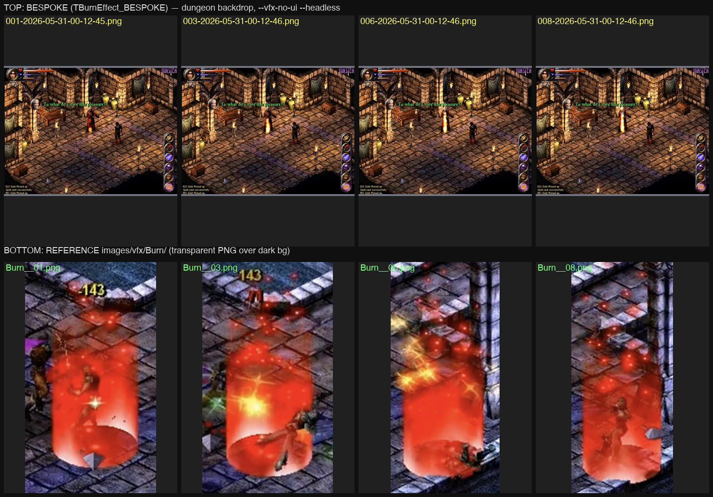

# A/B Pilot Retest: TBurnEffect_BESPOKE vs Game Reference (post-PresentForSnap fix)

- Date: 2026-05-31
- HEAD: `5a1cb08` (merge main + PresentForSnap impl)
- Backdrop: dungeon
- Test mode: `--test=vfx --vfx=TBurnEffect_BESPOKE --vfx-bg=dungeon --vfx-no-ui --headless --filmstrip=8,0.15`
- Bespoke per-frame: `/tmp/ab_burn2_001..008-2026-05-31-00-12-45/46.png`
- Bespoke filmstrip: `/tmp/ab_burn2_filmstrip.png`
- Reference frames: `images/vfx/Burn/Burn__01.png` ... `Burn__08.png`

## What changed since the original pilot

The earlier pilot (`burn_pilot.md` @ c33e6cf) captured **fully-black frames**
(`R=G=B=0` everywhere) because the headless harness wasn't presenting the
swapchain into the framesnap buffer. That has been fixed by `PresentForSnap`
on this HEAD. The retest captures now contain the dungeon backdrop, HUD, and a
visible (but small) flame at the test actor — so we can finally score the
effect itself, not just the rig.

## Comparison

Top row: bespoke `TBurnEffect_BESPOKE` (frames 001, 003, 006, 008 of 8 at 0.15 s spacing).
Bottom row: original game capture (`Burn__01`, `Burn__03`, `Burn__06`, `Burn__08`), composited over dark gray to make the alpha cutout visible.

## Frame extrema

Across all 8 bespoke frames: `R=[0,255]  G=[0,255]  B=[0,255]` (full range — captures are no longer black).
Center 160×200 ROI mean R/G/B drifts from `(102, 68, 49)` on frame 1 to
`(107, 73, 52)` on frame 8 — i.e. the orange flame is present and stable but
not growing into a bright red column the way the reference does.

## Score

| Axis      | Result   |
|-----------|----------|
| color     | low      |
| shape     | low      |
| density   | low      |
| timing    | low      |
| overall   | diverges |

## Observations

1. **Volume / shape.** Reference is a tall, near-cylindrical column of fire
   that fully engulfs the actor from feet to well above the head, with a hot
   bright core at the feet. Bespoke is a single thin vertical streak roughly
   the height of the actor's torso. No columnar volume — looks more like one
   FireWind sliver than the two stacked particle systems Burn requires.
2. **Color.** Reference is dominated by saturated red (R ≫ G, B ≈ 0) with a
   yellow-white hot core near the feet. Bespoke flame is orange/yellow with a
   warm mid-tone — the deep red dominance is absent, and there is no
   bright-core hotspot.
3. **Particle count / density.** M04 forensics requires `BURN_COUNT = 70`
   particles for `fire` *and* another 70 for `smoke` (two stacked
   `TParticleSystem` instances spawning off random character bone matrices,
   with a fire→smoke promotion on death). The bespoke output looks like a
   single thin emitter — there is no visible smoke trail and no scatter of
   embers/sparks.
4. **Ember sparks.** The reference shows discrete bright red sparks above and
   around the column on every frame. Bespoke has none.
5. **Attachment.** The flame does follow the actor's position (good — bone
   attachment hooked up) but the spread/radius is far too narrow.
6. **Timing.** Reference holds the column at full intensity across all 8
   frames (`BURN_FRAME = 50` ticks at full spawn rate before decay). Bespoke
   is essentially static between frames 1 and 8 — no ramp-up envelope and no
   discernible per-frame turbulence; particles look frozen rather than rising.

## Top 3 differences

1. Bespoke renders a single thin orange streak instead of a tall, fat, red
   columnar volume; the `fire` `TParticleSystem` is undersized (count, scale,
   spread) and the `smoke` `TParticleSystem` is missing or invisible.
2. Color hue is wrong: bespoke output is warm orange/yellow throughout, but
   the retail fire texture (`smoke01`) reads as deep saturated red with a
   yellow-white hotspot at the feet. Likely additive-blend math is correct
   but the texture/lit-mode or color tint is off.
3. No upward motion / no rising-particle behavior visible across the
   filmstrip — the bespoke effect appears nearly static frame-to-frame,
   suggesting per-tick velocity integration (`pos += vel * dt`) and/or scale
   decay (`scale *= BURN_DEC = 0.97`) are either not wired or not being
   advanced in test mode.

## Suggested fixes

- Re-check the two-`TParticleSystem` topology: spawn both `fire` (sub-object
  `smoke01`, `GetObject(1)`) and `smoke` (sub-object `smoke`, `GetObject(0)`)
  with `BURN_COUNT = 70` each. Currently the visual signature reads as a
  single thin emitter — at most one system is alive.
- Verify the spawn site is `ca->GetObjectMatrix(j)` for random bone `j` (not
  a single fixed origin). The narrow column suggests the spawn point is one
  vertical line on the body axis, not scattered across bones.
- Check per-particle scale range (`BURN_MIN_SCL`/`MAX_SCL`) and z-velocity
  range (`BURN_MIN_Z`/`MAX_Z`). The reference column is roughly the actor's
  shoulder-width × actor-height — the bespoke looks ~1/4 that width.
- Confirm the `fire`-particle texture pulls `smoke01` from
  `Magic/burnbabyburn.I3D` (the texture is the source of the deep-red hue);
  if the bespoke is sampling a different sub-object or no texture, the warm
  orange seen now is just additive blend of a pale fallback.
- Tick / `dt` plumbing: the lack of motion between frames at 0.15 s spacing
  implies particles are spawned but not animated. Confirm `TParticleSystem::
  Animate` is being called (life ticking, velocity integration, `acc`
  applied) on each test-mode frame, not just `Render`.
- Wire the fire→smoke promotion at end-of-life (`life_span` expires →
  re-emit into the smoke system with 1.25× scale). Currently no smoke trail
  is visible.
- Add `BURN_SPREAD` lateral jitter on emission so particles fan out from the
  bone matrices rather than stacking on a single column line.

## Reconstruction reference

See `docs/vfx/forensics/M04_TBurnEffect.md` §3 (constants), §4 (particle
shape + texture), §5 (animation state machine), §6 (render bracket =
AdditiveStraight ONE/ONE). All constants and pseudocode are present; this
retest gives us a concrete visual baseline to drive the reconstruction
against.
